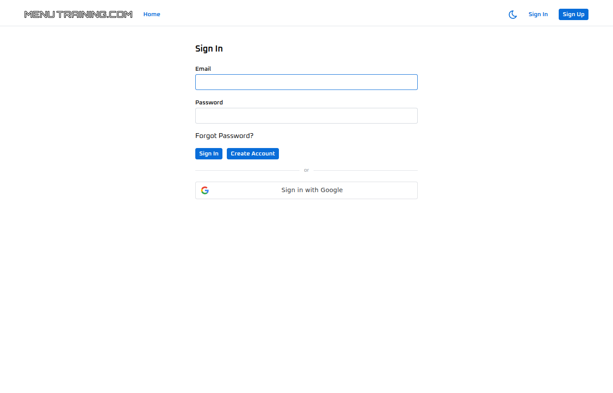
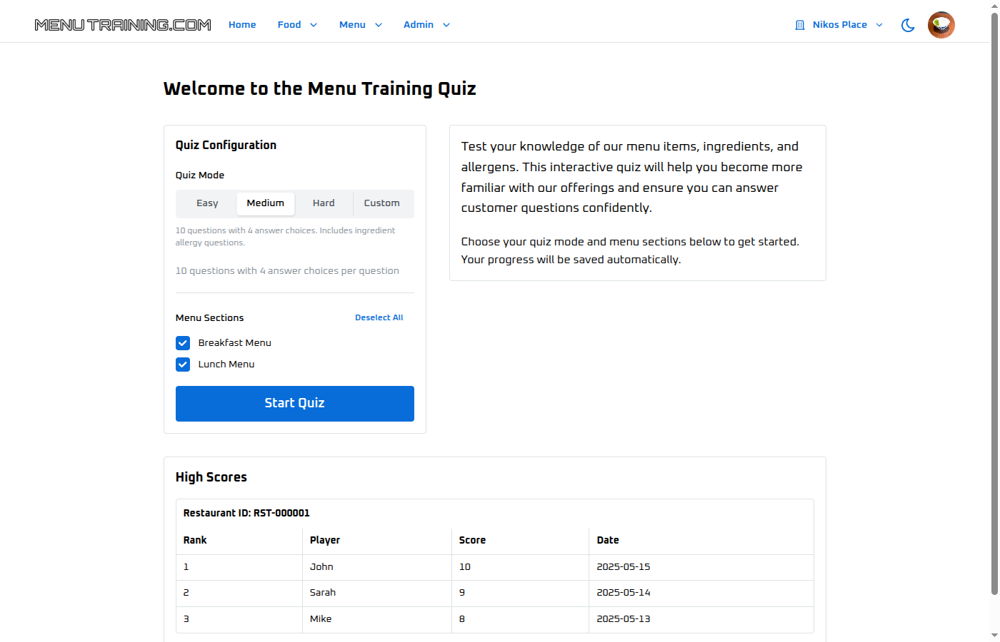
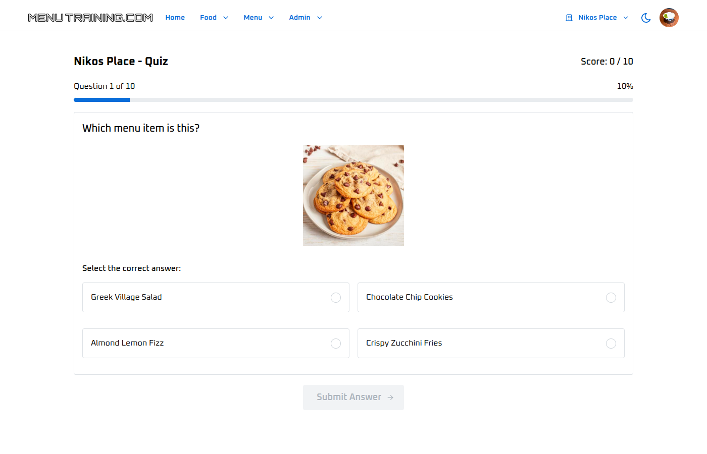
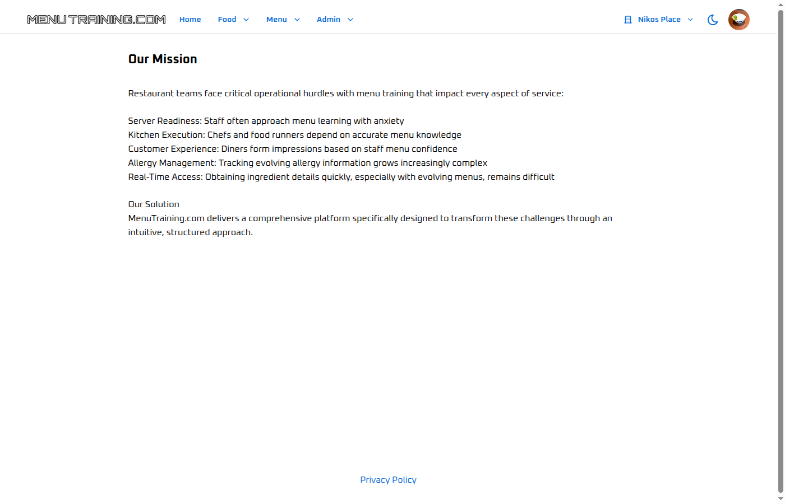
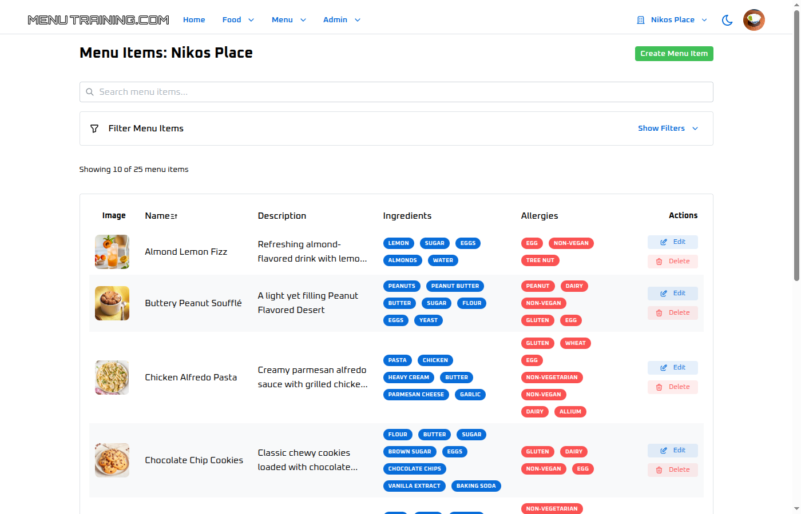
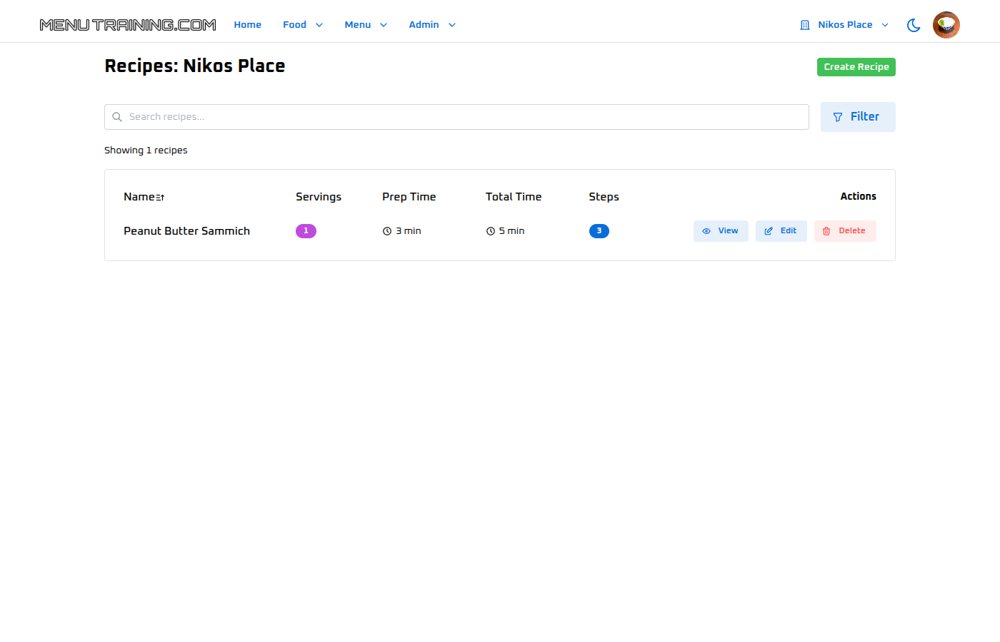

# Menu Training Platform - Frontend

A modern, interactive restaurant staff training application built with Next.js and Mantine UI. This platform helps restaurant employees learn about menu items, ingredients, recipes, and allergen information through an engaging quiz system.



## 🎯 Overview

Menu Training is a comprehensive restaurant management and staff training system that enables:
- Restaurant managers to organize menu data including ingredients, recipes, and allergen information
- Staff members to learn through interactive quizzes tailored to their restaurant's menu
- Multi-restaurant support for chains or franchises
- Real-time progress tracking and leaderboards

## ✨ Features

### 📊 Restaurant Management
- **Ingredients Management**: Track ingredients with allergen information, categories, and sub-ingredients
- **Menu Items**: Organize dishes with ingredients, pricing, and detailed descriptions
- **Recipes**: Step-by-step recipe management with equipment requirements
- **Menu Organization**: Structure items into menu sections (Breakfast, Lunch, Dinner, etc.)
- **Allergen Tracking**: Comprehensive allergen management for customer safety


### 🎮 Interactive Quiz System
- **Adaptive Difficulty**: Easy, Medium, Hard, and Custom difficulty levels
- **Dynamic Questions**: Automatically generated based on your restaurant's data
- **Question Types**:
  - Ingredient identification
  - Allergen awareness
  - Recipe knowledge
  - Menu item composition
- **Progress Tracking**: Real-time scoring and performance analytics
- **Leaderboards**: Restaurant-specific high score tracking




### 👥 User Management
- **Multi-Restaurant Support**: Users can access multiple restaurant locations
- **Role-Based Access**: Admin and staff roles with appropriate permissions
- **Profile Management**: Users can update their information and preferences
- **Authentication**: Secure JWT-based authentication with refresh tokens



### 🌐 Additional Features
- **Internationalization**: Multi-language support (currently English)
- **Responsive Design**: Works seamlessly on desktop, tablet, and mobile devices
- **Dark Mode**: Toggle between light and dark themes
- **Real-time Updates**: Live data synchronization across the platform

## 📋 Prerequisites

- Node.js 18+ 
- Yarn package manager
- Backend server running (see [menutraining-server](../menutraining-server/README.md))

## 🛠️ Installation

1. Clone the repository:
```bash
git clone <repository-url>
cd menutraining-mantine
```

2. Install dependencies:
```bash
yarn install
```

3. Create environment file:
```bash
cp example.env.local .env.local
```

4. Configure environment variables:
```env
NEXT_PUBLIC_API_URL=http://localhost:3001/api
NEXT_PUBLIC_IS_GOOGLE_AUTH_ENABLED=true
NEXT_PUBLIC_GOOGLE_CLIENT_ID=your-google-client-id
NEXT_PUBLIC_IS_SIGN_UP_ENABLED=true
NEXT_PUBLIC_FILE_DRIVER=s3
```

## 🏃‍♂️ Running the Application

### Development Mode
```bash
yarn dev
```
Application will be available at http://localhost:3000

### Production Build
```bash
yarn build
yarn start
```

## 📱 Application Structure

### Authentication


The application uses JWT-based authentication with support for:
- Email/password login
- Google OAuth
- Refresh token rotation
- Password reset functionality

### Restaurant Management

#### Ingredients Management


- Add, edit, and delete ingredients
- Track allergen information
- Categorize ingredients
- Search and filter functionality

#### Menu Items


- Create menu items with detailed descriptions
- Link ingredients to menu items
- Set pricing and availability
- Organize by menu sections

#### Recipes


- Step-by-step recipe instructions
- Equipment requirements
- Ingredient measurements
- Cooking times and temperatures

### Quiz System

#### Quiz Configuration


- Select difficulty level
- Choose menu sections to include
- View high scores leaderboard

#### Quiz Gameplay


- Interactive questions based on restaurant data
- Real-time feedback
- Progress tracking
- Score calculation

## 🧪 Testing

### Run All Tests
```bash
npm test
```

### Run Specific Test Suites
```bash
# Authentication tests
npm run test:auth

# Quiz functionality tests
npm run test:quiz

# Restaurant data management tests
npm run test:restaurant

# Complete demo walkthrough
npm run test:demo
```

### Run Tests with UI
```bash
npm run test:ui
```

## 📁 Project Structure

```
menutraining-mantine/
├── src/
│   ├── app/                    # Next.js app directory
│   │   └── [language]/         # Internationalized routes
│   │       ├── admin-panel/    # Admin features
│   │       ├── restaurant/     # Restaurant management
│   │       └── profile/        # User profile
│   ├── components/             # Reusable components
│   │   ├── allergies/          # Allergy-related components
│   │   ├── equipment/          # Equipment components
│   │   ├── ingredients/        # Ingredient components
│   │   ├── menu-items/         # Menu item components
│   │   ├── menus/              # Menu components
│   │   ├── recipes/            # Recipe components
│   │   └── theme/              # Theme components
│   ├── services/               # Business logic and API calls
│   │   ├── api/                # API service layer
│   │   ├── auth/               # Authentication services
│   │   ├── i18n/               # Internationalization
│   │   ├── quiz/               # Quiz logic and generators
│   │   └── restaurant/         # Restaurant context
│   └── hooks/                  # Custom React hooks
├── playwright-tests/           # E2E tests
├── public/                     # Static assets
└── docs/                       # Documentation
```

## 🔧 Configuration

### Theme Customization
The application uses Mantine UI with custom theme configuration. Modify `src/components/theme/mantine-provider.tsx` to customize:
- Colors
- Typography
- Spacing
- Component styles

### API Configuration
API endpoints are configured in `src/services/api/config.ts`. The base URL is set via environment variable `NEXT_PUBLIC_API_URL`.

### Authentication
Authentication configuration is in `src/services/auth/config.ts`. Supports:
- JWT token management
- Refresh token rotation
- Social authentication (Google)

## 🚢 Deployment

### Vercel (Recommended)
1. Push code to GitHub
2. Import project in Vercel
3. Configure environment variables
4. Deploy

### Docker
```bash
docker build -t menutraining-frontend .
docker run -p 3000:3000 menutraining-frontend
```

### Traditional Hosting
1. Build the application: `yarn build`
2. Copy `.next`, `public`, and `package.json` to server
3. Install production dependencies: `yarn install --production`
4. Start: `yarn start`

## 🤝 Contributing

1. Fork the repository
2. Create feature branch (`git checkout -b feature/AmazingFeature`)
3. Commit changes (`git commit -m 'Add some AmazingFeature'`)
4. Push to branch (`git push origin feature/AmazingFeature`)
5. Open a Pull Request

## 📄 License

This project is licensed under the MIT License - see the LICENSE file for details.

## 🆘 Support

For support, email support@menutraining.com or open an issue in the GitHub repository.

## 🔗 Related Projects

- [Menu Training Server](../menutraining-server) - Backend API server
- [React Boilerplate](https://github.com/brocoders/extensive-react-boilerplate) - Original boilerplate this project was based on